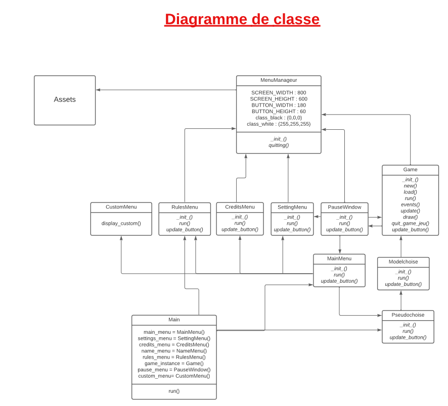

# Gravity Glitch


## Introduction

Welcome to Gravity Glitch, an innovative project created by 7th-semester engineering students from École Nationale Supérieure de l'Électronique et de ses Applications (ENSEA). This project serves as a platform for hands-on learning in practical electronics, software development, project management, and teamwork.

## Project Objective

Our primary goal is to develop an exciting game inspired by the popular Flappy Bird game, with a unique twist – an innovative controller. We've integrated an infrared sensor into the game, which measures the distance between the player's hand and the sensor. This inventive controller allows players to guide "Flappy" through the game, helping it navigate obstacles and accumulate points.

## Getting Started

To get started with the project, follow these steps:

1. Clone the repository to your local machine:

   ```bash
   git clone https://github.com/LeticiaAires/Gravity-Glitch.git
   ```

2. Ensure you have the required dependencies installed.

   [VSCode](https://code.visualstudio.com/download)
 
   [Python]( https://www.python.org/downloads/)
 
   [PIP](https://bootstrap.pypa.io/get-pip.py)

4. How to play ?
   
   - Run the "main.py" file 
   
   - Click on the "Play" button to choose your pseudo and choose your game mode !

5. Create a virtual environment to launch the game without installing all modules and packages on your machine :

   - Create the environment 'my_env' inside the project directory 
   ```bash
   python -m venv my_environment
   ```

   - Activate the environment
     ```bash
   my_environment/bin/activate
   ```

   - Install the required dependencies
   ```bash
   pip install -r requirements.txt
   ```

  - Run the Game.py file and play !

   - Deactivate the environment
   ```bash
   deactivate
   ```

## Features

- Flappy Bird-inspired gameplay with a unique controller.
- Innovative use of an infrared sensor for hand tracking.
- Challenging obstacles and addictive gameplay.
- Project designed and implemented by talented engineering students.

## Documentation
Here is an explanation of the game's structure : 

The "main.py" file is the file to run to start the Game. Then, we come across a window called "MainMenu" displaying the menu of the game (with the settings, play, quit, credits and rules buttons). From there, we can : 
- go to the settings/rules/credits windows who are self explanatory
- quit the game
- go to the play window
  
If you choose to do the later, then you will come across a first window asking for your name (to associate your score with your pseudo). From there you can either go back to the menu or continue and go choose your game mode (History mode or alternative = a more complex version of the flappy bird).
After that, by clicking on continue and pressing the space bar, you can start playing !
You have a "pause" button in the bottom left corner where you can go to the settings, see the best scores, restart, resume or quit the game. 
  
For more detailed information about the project, you can refer to the code itself. We have included comprehensive comments and documentation within the codebase to help you understand how everything works.


## License

This project is licensed under the [MIT License](LICENSE.md).

## Acknowledgments

We would like to express our gratitude to our instructors, mentors, and everyone who supported us throughout this project. Your guidance and encouragement were invaluable in making this project a reality.

## Collaborators

<table>
  <tr>
    <td align="center">
      <a href="#">
        
        <sub>
          <b>Anthony </b>
          </p>AnthonyDelille01     
        </sub>
      </a>
    </td>
    <td align="center">
      <a href="#">
        <br>
        <sub>
          <b>Cassandre   </b>
          </p>CassandreChandelier   
        </sub>
      </a>
      <td align="center">
      <a href="#">
        <br>
        <sub>
          <b>Douay Nicolas</b>
          </p>DBXYD
        </sub>
      </a>
    </td>
    <td align="center">
      <a href="#">
        <br>
        <sub>
          <b>Letícia Aires</b>
          </p>LeticiaAires
        </sub>
      </a>
    </td>
    <td align="center">
      <a href="#">
        <br>
        <sub>
          <b>Mael Doublet</b>
          </p>MaelDoublet
        </sub>
      </a>
      <td align="center">
      <a href="#">
        <br>
        <sub>
          <b>Mantou</b>
          </p>Mansko09
        </sub>
      </a>
<td align="center">
      <a href="#">
        <br>
        <sub>
          <b>Mathieu Daubercies</b>
          </p>MathieuDaubercies
        </sub>
      </a>
      <td align="center">
      <a href="#">
        <br>
        <sub>
          <b>Solène</b>
          </p>salom0701
        </sub>
      </a>
      <td align="center">
      <a href="#">
        <br>
        <sub>
          <b>Romain</b>
          </p>Romain04G
        </sub>
      </a>
      <td align="center">
      <a href="#">
        <br>
        <sub>
          <b>Zineb</b>
          </p>Ninevv
        </sub>
      </a>
